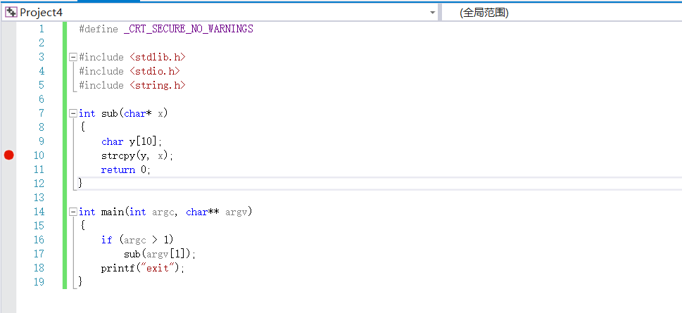
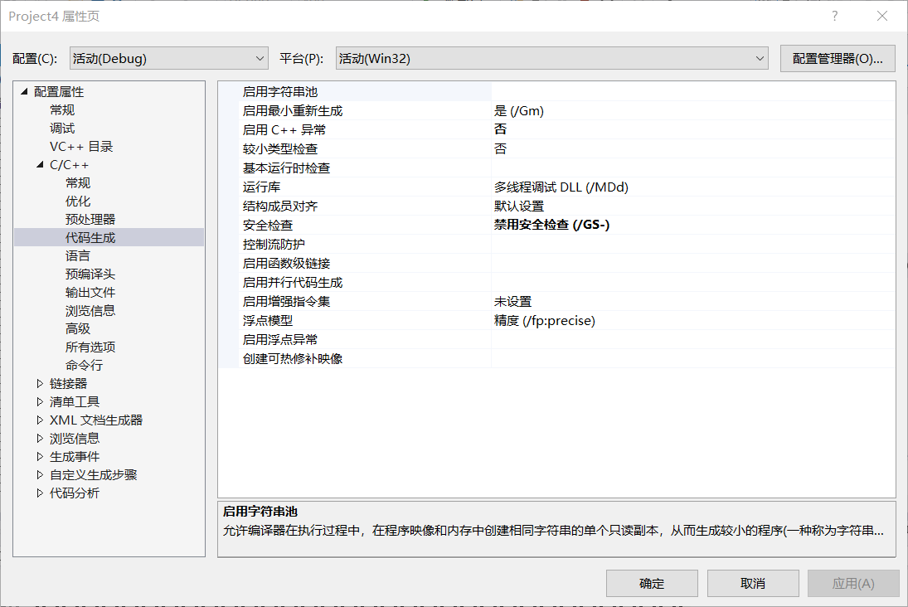
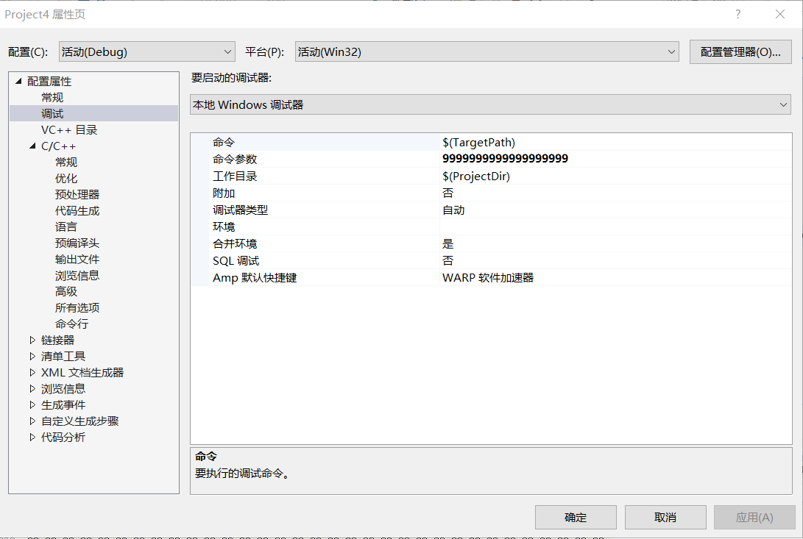
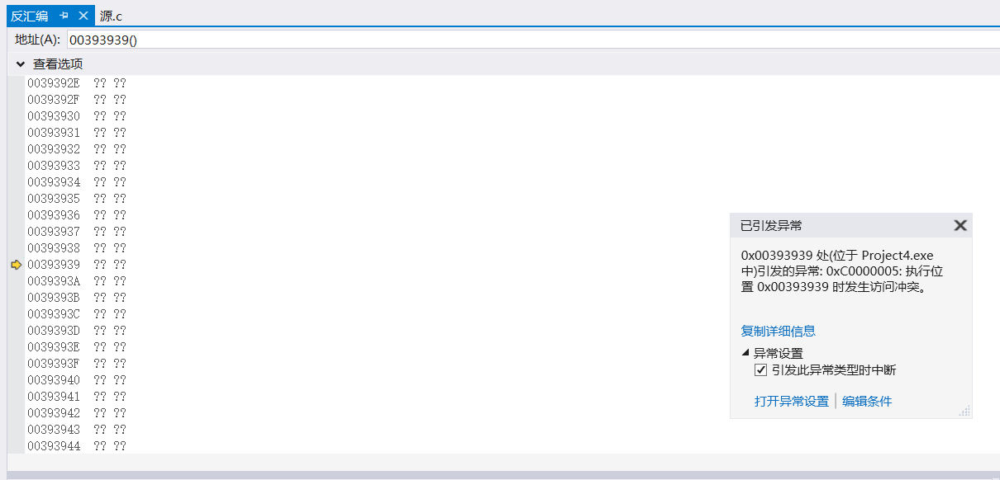

# 数据缓冲区溢出实验报告

## 一.实验前准备

### 1.关闭C++异常，禁用安全检查，关闭SDL检查







## 二.设置内存地址




## 三.执行测试代码

```c
#define _CRT_SECURE_NO_WARNINGS

#include <stdlib.h>
#include <stdio.h>
#include <string.h>

int sub(char* x)
{
	char y[10];
	strcpy(y, x);
	return 0;
}

int main(int argc, char** argv)
{
	if (argc > 1)
		sub(argv[1]);
	printf("exit");
}
```

在strcpy函数处设置断点，进入反汇编

因为strcpy函数只将一地址上的字符串复制给另一字符串，而不考虑两字符串的长度问题，导致数据缓冲区溢出

逐语句进行调试，直到转入0x00393939地址，此地址不存在，引发异常




