# 实验四

----

## 实验目的

完成dll文件的创建与调用，分别使用dumpbin,process explorer,dependency walker进行分析

## 实验要求

1、会编写dll。把.c文件编译为obj文件，把obj文件和lib文件链接为新的dll和lib文件。注意使用def文件定义导出函数。

2、编写一个exe，调用第一步生成的dll文件中的导出函数。方法是（1）link是，将第一步生成的lib文件作为输入文件。（2）保证dll文件和exe文件在同一个目录，或者dll文件在系统目录。

3、第二步调用方式称为load time 特点是exe文件导入表中会出先需要调用的dll文件名及函数名，并且在link 生成exe时，需明确输入lib文件。还有一种调用方式称为 run time。参考上面的链接，使用run time的方式，调用dll的导出函数。包括系统API和第一步自行生成的dll，都要能成功调用。

## 实验过程

### 动态链接

* 增加a.c与b.c文件

```c
//a.c
int main()
{
	sub();
}
```

```c
//b.c
#include<Windows.h>
int sub()
{
	return 0;
}
```

* 在vs中点击工具，使用开发者命令提示进入cmd

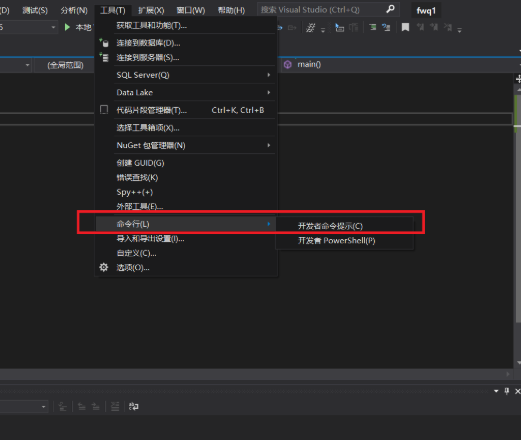

* 使用命令`cl.exe /c +xx.c`对a.c与b.c进行编译，生成a.obj、b.obj文件

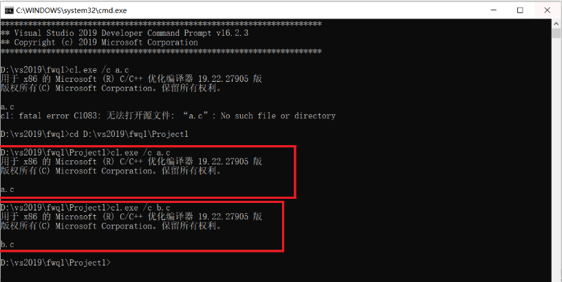

* 输入以下命令对a.obj和b.obj进行链接，生成haha.exe

```
link a.obj b.obj /out:haha.exe
```

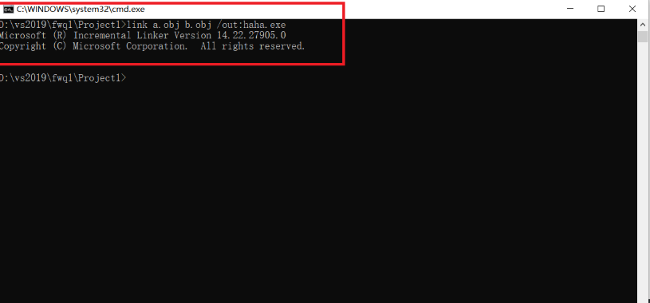

* 修改b.c中文件如下

```c
#include<Windows.h>
int sub()
{
	MessageBox(0, "msg", 0, 0);
	return 0;
}
```

* 重新对b.c进行编译。编译后输入以下命令对a.obj和b.obj进行链接时，由于MessageBox模块在User32.lib中，而没有加上此库进行链接则会引发报错“找不到指定模块”

```
link a.obj b.obj /out:haha.exe
```

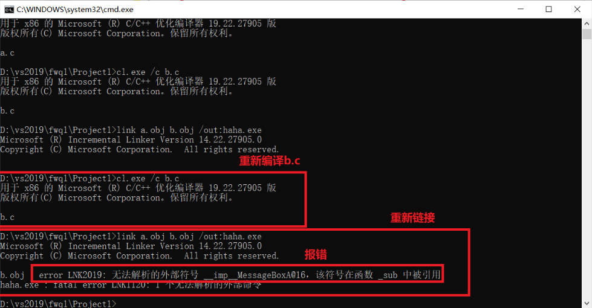

* 在link时加上User32.lib，此时便可以成功生成hehe.exe，双击可弹出messagebox

```
link a.obj b.obj User32.lib /out:hehe.exe
```

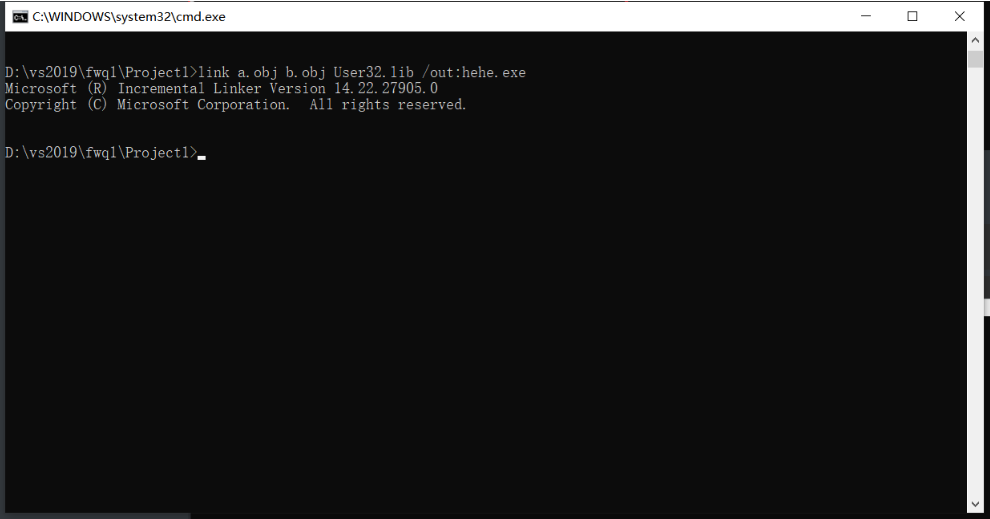

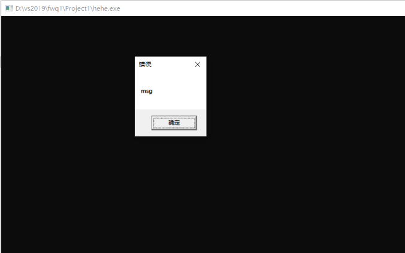

* 使用dumpbin分别查看haha.exe和hehe.exe的库,hehe.exe比haha.exe多出来user32.dll这个链接库

```
dumpbin /imports haha.exe
dumpbin /imports hehe.exe
```

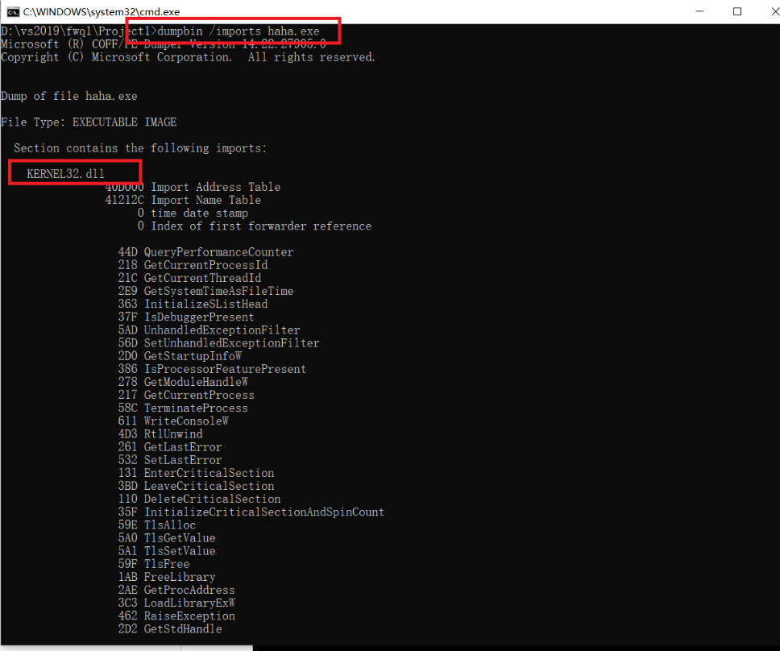

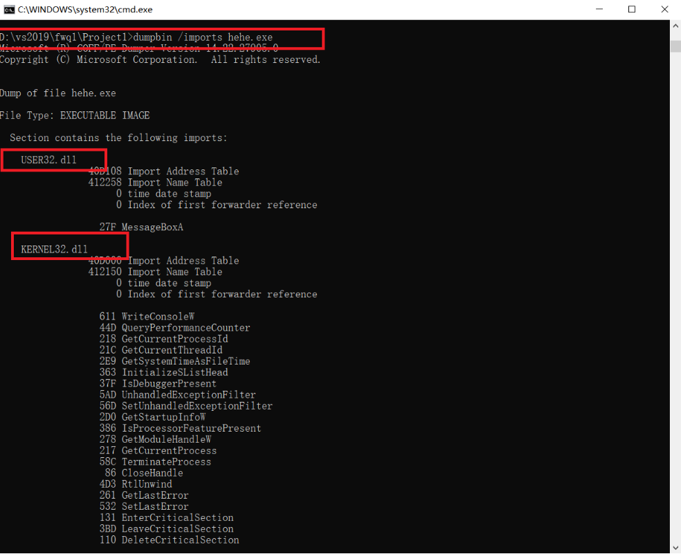

* 使用dependency分别查看haha.exe和hehe.exe的动态链接库调用关系，结果与刚刚一致

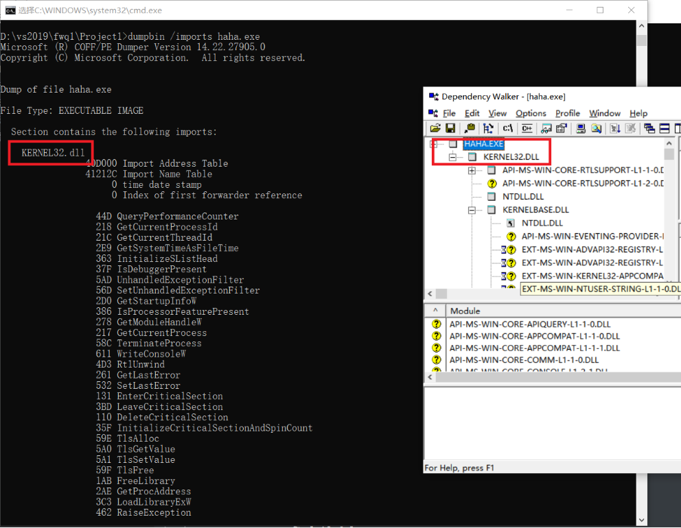

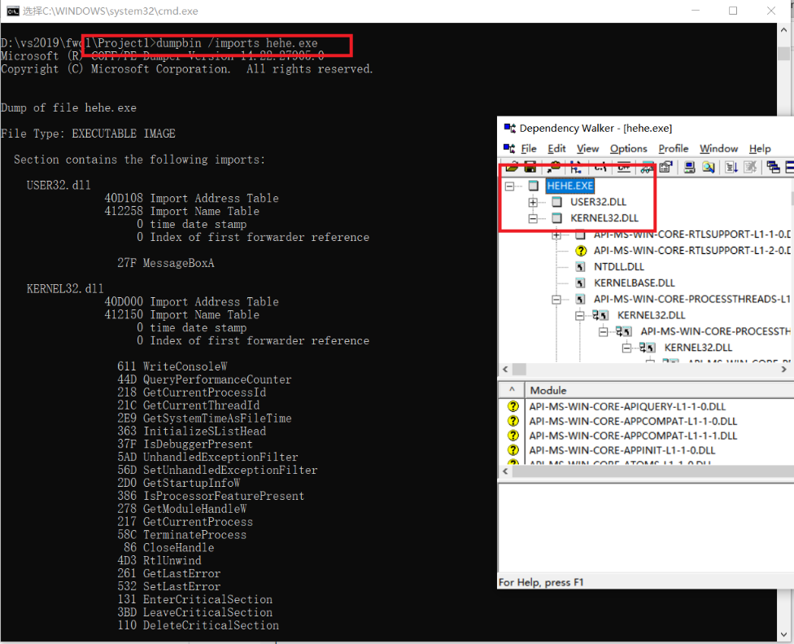

* 使用Process Explorer打开DLLs，进行查看对比，可看到结果基本一致

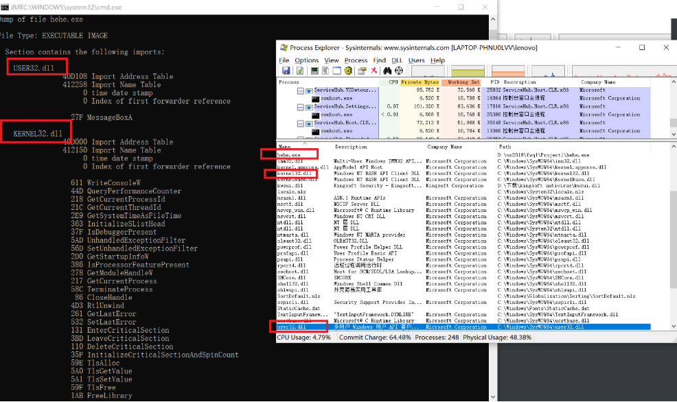

### load time方式调用dll文件

* 新建项目，添加base.c和exp.def

```c
//base.c
#include<Windows.h>
int intnal_function()
{
	return 0;
}
int lib_function(char* msg)
{
	//do some works
	MessageBoxA(0, "msg from base lib", msg, "OK");
    return 0;
}
```

```c
//exp.def
LIBRARY baselib
EXPORTS
    lib_function
```

* 对base.c进行编译生成base.obj

```
cl.exe /c base.c
```

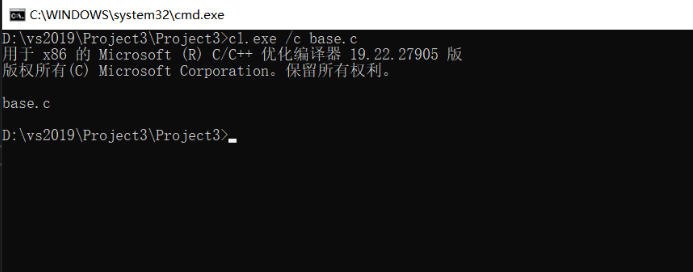

* 使用下面的命令对base.obj进行链接

```
link base.obj User32.lib /dll /def:exp.def
```

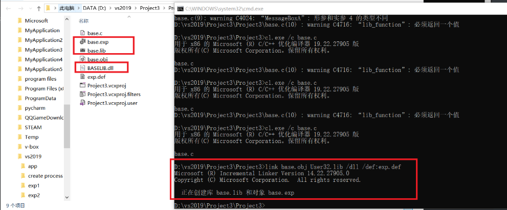

* 编译app.c生成app.obj

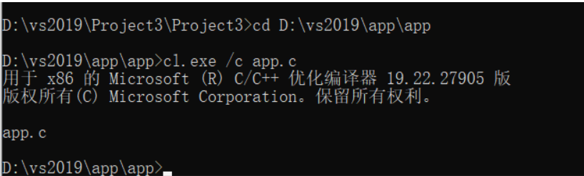

* 将刚刚生成的app.exe链接时需要的base.lib与BASELIB.dll粘贴进app的目录，使用下列命令进行链接

```
link app.obj base.lib /out:app.exe
```

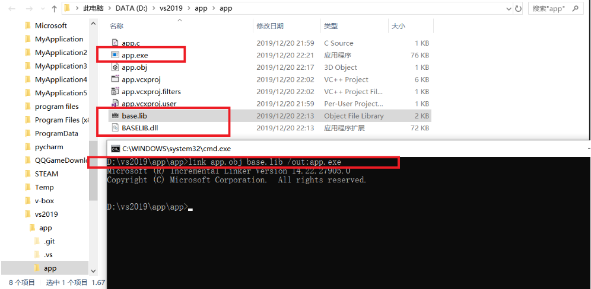

### run time方式调用dll文件

* 新建一个run.c

```c
#include <stdio.h>
#include <windows.h>

typedef int(__cdecl* MYPROC)(LPWSTR);

int main()
{
    HINSTANCE hinstLib;
    MYPROC ProcAdd;
    BOOL fFreeResult, fRunTimeLinkSuccess = FALSE;

    // Get a handle to the DLL module.
    hinstLib = LoadLibrary(TEXT("baselib.dll"));
    // baselib.dll不一定放在同一目录下，但调用的路径要保证正确

    // If the handle is valid, try to get the function address.
    if (hinstLib != NULL)
    {
        ProcAdd = (MYPROC)GetProcAddress(hinstLib, "lib_function");

        // If the function address is valid, call the function.
        if (NULL != ProcAdd)
        {
            fRunTimeLinkSuccess = TRUE;
            (ProcAdd)("Run Time: EXE call a DLL");
        }

        // Free the DLL module.
        fFreeResult = FreeLibrary(hinstLib);
    }

    // If unable to call the DLL function, use an alternative.
    if (!fRunTimeLinkSuccess)
        printf("Message printed from executable\n");
    return 0;
}
```

* 编译run.c生成run.obj
* 将之前生成的BASELIB.dll复制到run.c的目录下
* 使用如下命令进行链接（由于该程序使用运行时动态链接，所以不必将模块与DLL的导入库链接）此时可以在同目录下找到BASELIB.dll，程序链接运行成功

```
link run.obj
```

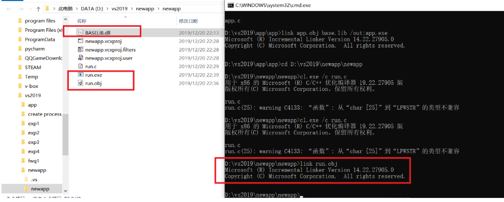

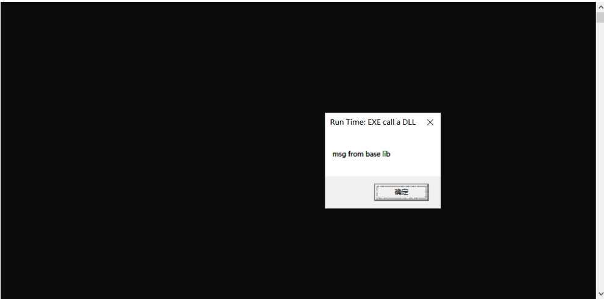

* 删除BASELIB.dll，重新生成.obj文件及.exe文件，再运行时，会打印`Message printed from executable`，说明调用下列代码，链接时失败，但能及时响应错误

```c
if (!fRunTimeLinkSuccess)
    printf("Message printed from executable\n");
```

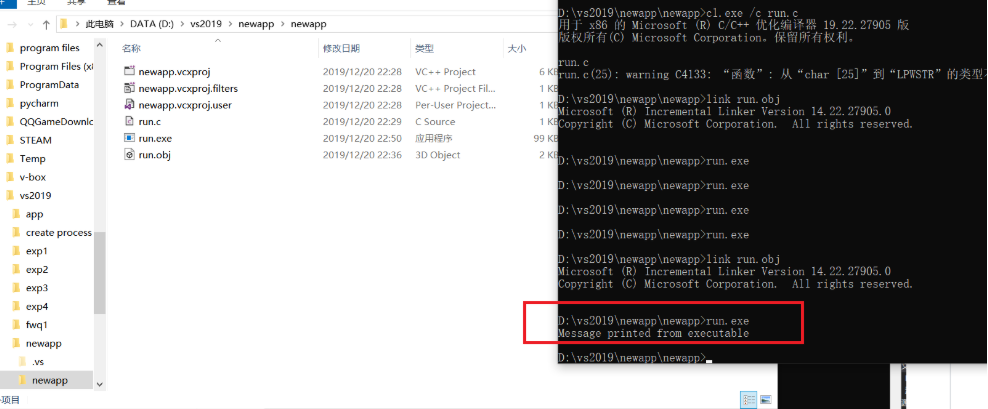

## 实验总结

* load-time 动态链接方式链接时需要链接`.lib`文件，出错时就结束程序；run-time 动态链接方式链接时无需链接`.lib`文件，并且在出错时可以对错误做出响应
